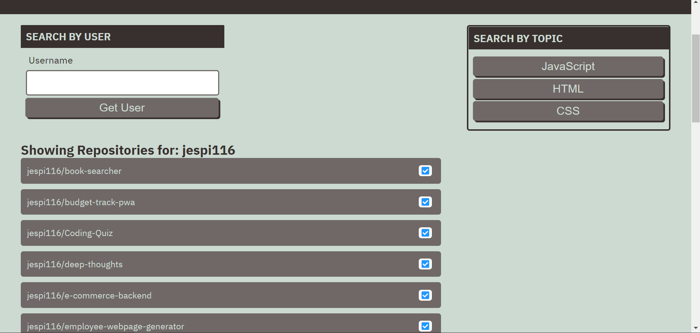

# Git It Done

## Description
This Webpage allows users to search for repositories with open issues based on username or between the choice of three programming languages. This page is driven by HTML, CSS, Javascript, and the GitHub Repository API. Below are several screenshots as well as a link to direct anyone to the live webpage!

## Image Previews 

### Home Page:

### Search by User:

### Search by Language:

## Link

https://jespi116.github.io/git-it-done/
